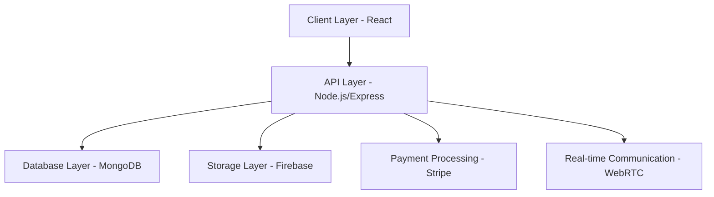

# eventBase Event Management System 🎫

<div align="center">

[](LICENSE)
[](https://reactjs.org/)
[](https://nodejs.org/)
[](https://www.mongodb.com/)
[](https://www.typescriptlang.org/)

A modern event management platform for seamless attendee engagement and interactive experiences.

[Features](#features) • [Installation](#installation) • [Tech Stack](#tech-stack) • [Architecture](#architecture) • [Contributing](#contributing)

</div>

## 🌟 Features

- **Real-time Event Interactions**
  - Live streaming capabilities for premium users
  - Interactive note-taking with multimedia support
  - QR code-based identity verification

- **Cross-Platform Accessibility**
  - Seamless media uploads
  - Content sharing across platforms
  - Responsive design for all devices

- **Enhanced Attendee Experience**
  - Interactive session tracking
  - Multimedia-enhanced note-taking
  - Real-time notifications

## 🚀 Installation

### Prerequisites

- Node.js (v18 or higher)
- MongoDB (v8.10.1 or higher)
- npm or yarn

### Frontend Setup

```bash
# Clone the repository
git clone https://github.com/your-username/comfybase.git

# Navigate to frontend directory
cd comfybase/frontend

# Install dependencies
npm install

# Start development server
npm run dev
```

### Backend Setup

```bash
# Navigate to backend directory
cd ../backend

# Install dependencies
npm install

# Set up environment variables
cp .env.example .env

# Start server
npm run dev
```

## 🛠️ Tech Stack

### Frontend
- React 19.0.0
- TailwindCSS 4.0.8
- Material UI 6.4.5
- React Router 7.2.0
- TypeScript 5.7.2
- Framer Motion 12.4.7
- wss

### Backend
- Node.js with Express
- MongoDB 8.10.1
- Firebase Admin 13.1.0
- Stripe Integration
- WebRTC for real-time communication

### Development Tools
- Vite 6.1.0
- ESLint 9.19.0
- TypeScript ESLint
- Jest for testing

## 🏗️ Architecture



## 🔐 Environment Variables

Create a `.env` file in the backend directory:

```env
MONGODB_URI=your_mongodb_uri
FIREBASE_CONFIG=your_firebase_config
STRIPE_SECRET_KEY=your_stripe_secret
JWT_SECRET=your_jwt_secret
```

## 📝 API Documentation

### Authentication Endpoints
```
POST /api/auth/login
POST /api/auth/register
GET /api/auth/verify
```

### Event Management
```
GET /api/events
POST /api/events
PUT /api/events/:id
DELETE /api/events/:id
```

### User Interaction
```
POST /api/notes
GET /api/streams
POST /api/media/upload
```

## 🧪 Testing

```bash
# Run frontend tests
cd frontend && npm test

# Run backend tests
cd backend && npm test

# Run e2e tests
npm run test:e2e
```

## 🤝 Contributing

1. Fork the repository
2. Create your feature branch (`git checkout -b feature/AmazingFeature`)
3. Commit your changes (`git commit -m 'Add some AmazingFeature'`)
4. Push to the branch (`git push origin feature/AmazingFeature`)
5. Open a Pull Request

## 📜 License

This project is licensed under the MIT License - see the [LICENSE](LICENSE) file for details.

## 👥 Team

- Barack Oduor Ouma - Project Lead & Software Engineer

## 🙏 Acknowledgments

- Dr. Kennedy Siika - Project Supervisor
- Kenyatta University - Department of Computing and Information Sciences
